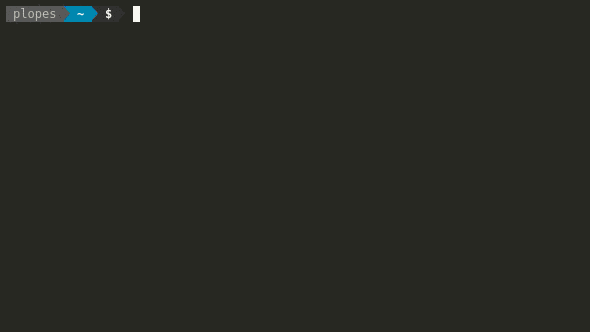

# Hello World

The simplest application we can create is an `Hello World` in a file `hello-es4x.js`:

```js
vertx.createHttpServer()
  .requestHandler(req => {
    req.response()
      .end('Hello ES4X world!');
  })
  .listen(8080);
```

You can now run this application using:

```bash
$ es4x hello-es4x.js
```

::: tip
In UNIX systems, scripts can be made executable and the shebang `#!/usr/bin/env es4x` used which will make them
auto-runnable.
:::

And in a second terminal:

```bash
$ curl localhost:8080
Hello ES4X world!
```

::: warning
Running scripts using the `es4x` command directly can be useful for small scripts that have no other dependencies than
`vertx`. For more complex application a project and package manager shall be used.
:::

## Create a new project

ES4X uses `npm` as the project management tool, to create a new project an utility command is provided:

```bash
# create a project dir
mkdir myapp

# change into the project dir
cd myapp

# create the project
es4x init
```

A project is a `package.json` file with a few items already pre configured:

```json{7-9,12}
{
  "version" : "1.0.0",
  "description" : "This is a ES4X empty project.",
  "name" : "myapp",
  "main" : "index.js",
  "scripts" : {
    "test" : "es4x-launcher test index.test.js",
    "postinstall" : "es4x install",
    "start" : "es4x-launcher"
  },
  "dependencies": {
    "@vertx/core": "latest"
  },
  "keywords" : [ ],
  "author" : "",
  "license" : "ISC"
}
```

The `post-install` hook will delegate to es4x to resolve all `maven` maven dependencies and create the `es4x-launcher`
script.

::: tip
The `es4x-launcher` script will ensure that the application is run or tested using es4x and not `nodejs`.
:::

### create-vertx-app

With the `create-vertx-app` you can quickly bootstrap your ES4X TypeScript or JavaScript
application with a new keystrokes. If GUI is the preferred way to create applications, then
the same generator can be used as a [PWA](https://vertx-starter.jetdrone.xyz/#npm).



## Adding dependencies

Adding dependencies is not different from what `JavaScript` developers are used to do:

```bash
# add other dependencies...
yarn add -D @vertx/unit # OR npm install @vertx/unit --save-dev
yarn add @vertx/web # OR npm install @vertx/web --save-prod

# will trigger the download
# of the java dependencies
npm install
```

## Coding

With the project setup complete it is time to write some code. As it was stated before, ES4X uses `TypeScript`
definitions to provide a better developer experience with code completion and optional type checks.

With all ES4X applications there is a global object `vertx` which is the configured instance of *vert.x* that can be
used in the application.

::: tip
In order to get code completion on [Visual Studio Code](https://code.visualstudio.com/) the first line of your main
script should be:

```js
/// <reference types="@vertx/core/runtime" />
```
:::

The hello application `index.js` should be like:

```js{3}
/// <reference types="@vertx/core/runtime" />
// @ts-check
import { Router } from '@vertx/web';

const app = Router.router(vertx);

app.route('/').handler(ctx => {
  ctx.response()
    .end('Hello from Vert.x Web!');
});

vertx.createHttpServer()
  .requestHandler(app)
  .listen(8080);
  
console.log('Server listening at: http://localhost:8080/')
```

This app starts a server and listens on port 8080 for connections. The app responds with "`Hello from Vert.x Web!`" for
requests to the root URL (`/`) or route. For every other path, it will respond with a **404 Not Found**.

::: warning
ES6 module syntax can be used in `.js` files. ES4X will translate those to `commonjs` `require()` statements however
`exports` will not be translated. This feature is only to assist working with IDEs that can perform auto import such as
`Visual Studio Code`.
:::

## MJS support

ES4X supports `.mjs` files too. In this case module resolution will not use `commonjs` `require()` but will make use of
graaljs native module loader.

With graaljs `.mjs` support both `import` and `export` will work as per design of the ES6 spec.

::: tip
To enable `.mjs` support either use the extension `.mjs` in your `JavaScript` files, or start your application with the
flag `-esm`.
:::

::: warning
It is not possible to mix `commonjs` and `esm` in the same project. If unsure, use `commonjs`.
:::
