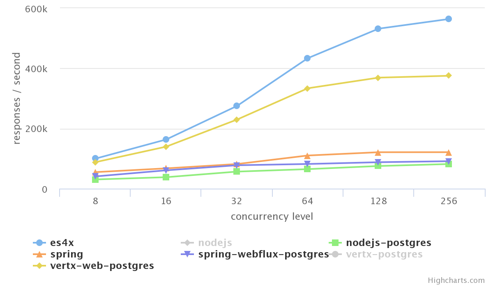

# Fast, unopinionated,<br/> minimalist JavaScript runtime for [Vert.x](https://vertx.io)

```
npx es4x-cli init
```

[](https://travis-ci.org/reactiverse/es4x)
[](http://search.maven.org/#search%7Cga%7C1%7Cg%3A%22io.reactiverse%22%20AND%20a%3A%22es4x%22)
[](https://codecov.io/gh/reactiverse/es4x)

## Performance

ES4X provides a thin layer of JavaScript, without obscuring Vert.x features that you know and love. 



## Familiar API

```js
/// <reference types="@vertx/core/runtime" />
// @ts-check
import { Router } from '@vertx/web';

const app = Router.router(vertx);

app.route().handler(function (ctx) {
  ctx.response().end('Hello from ES4X Vert.x Web!');
});

vertx.createHttpServer()
  .requestHandler(app)
  .listen(8080);
```

Familiar API for Vert.x developers and type safety provided by [TypeScript](https://www.typescriptlang.org/) definitions
on all known APIs.

## DevOps friendly

```bash
$ npm run package -- -d

Running: mvnw ... 
Running: docker ... 
Run your application with:

  docker run --rm -it --net=host my-project:1.0.0
```

Deploy your applications as a runnable jar or as a [Docker](https://www.docker.com/) container.
