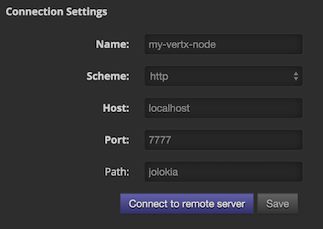
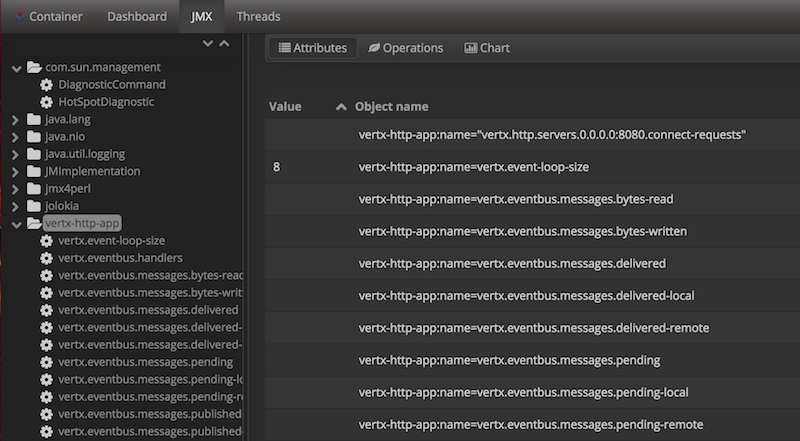

This project implements the Vert.x Metrics Service Provider Interface
(SPI) reporting metrics to the [Dropwizard
metrics](https://github.com/dropwizard/metrics) library.

# Features

A fairly simple API to retrieve metrics via the `Measured` interface
which is implemented by various Vert.x components like `HttpServer`,
`NetServer`, and even `Vertx` itself.

Configurable JMX reporting based on Dropwizard implementation, exposing
Vert.x as JMX MBeans.

# Getting started

To enable metrics, add the following dependency to the *dependencies*
section of your build descriptor:

  - Maven (in your `pom.xml`):

<!-- end list -->

``` xml
<dependency>
 <groupId>io.vertx</groupId>
 <artifactId>vertx-dropwizard-metrics</artifactId>
 <version>${maven.version}</version>
</dependency>
```

  - Gradle (in your `build.gradle` file):

<!-- end list -->

``` groovy
compile 'io.vertx:vertx-dropwizard-metrics:${maven.version}'
```

Then when you create vertx enable metrics using the
`DropwizardMetricsOptions`:

``` js
import { Vertx } from "@vertx/core"
let vertx = Vertx.vertx(new VertxOptions()
  .setMetricsOptions(new DropwizardMetricsOptions()
    .setEnabled(true)));
```

You can also enable JMX:

``` js
import { Vertx } from "@vertx/core"
let vertx = Vertx.vertx(new VertxOptions()
  .setMetricsOptions(new DropwizardMetricsOptions()
    .setJmxEnabled(true)));
```

To see details about JMX see the [JMX](#jmx) section at the bottom.

# Command line activation

When running Vert.x from the command line interface, metrics can be
activated via JVM system properties. System properties beginning with
*vertx.metrics.options.* are transmitted to the metrics options.

The *vertx.metrics.options.enabled* is a standard Vert.x Core option for
enabling the metrics implementations, this options must be set to
`true`:

    java -jar your-fat-jar -Dvertx.metrics.options.enabled=true

The `vertx.metrics.options.registryName` configures the [Dropwizard
Registry](#dropwizard-registry) to use:

    java -jar your-fat-jar -Dvertx.metrics.options.enabled=true -Dvertx.metrics.options.registryName=my-registry

The `vertx.metrics.options.jmxEnabled` and
`vertx.metrics.options.jmxDomain` configures the [JMX](#jmx)
registration:

    java -jar your-fat-jar -Dvertx.metrics.options.enabled=true -Dvertx.metrics.options.jmxEnabled=true ...

The `vertx.metrics.options.configPath` option allows to reconfigure the
metrics from a property file.

# Metrics service

While Vert.x core defines an SPI for reporting metrics (implemented for
instance in this project), it does not define an API for retrieving
metrics (because some metrics collectors just do reporting and nothing
more).

The `MetricsService` provides an API in front of the Dropwizard Registry
to get metrics data snapshots.

## Naming

Each measured component listed below (except for Vertx) will have a base
name associated with it. Each metric can be retrieved by providing the
fully qualified name \<fqn\> `baseName` + `.` + `metricName` from Vertx:

``` js
let metrics = metricsService.getMetricsSnapshot(vertx);
metrics.vertx.eventbus.handlers;
```

or from the measured component itself using just the metric name:

``` js
let eventBus = vertx.eventBus();
let metrics = metricsService.getMetricsSnapshot(eventBus);
metrics.handlers;
```

See more examples below on how to retrieve/use metrics for a specific
component.

Metrics names can also be listed:

``` js
let metricsNames = metricsService.metricsNames();
metricsNames.forEach(metricsName => {
  console.log("Known metrics name " + metricsName);
});
```

`baseName` defaults to `vertx`, but can be set to a custom value:

``` js
let metricsOptions = new DropwizardMetricsOptions()
  .setBaseName("foo");
```

## Retrieving metrics

Once enabled, the `MetricsService` allows to retrieve metrics snapshots
from any `Measured` object which provides a map of the metric name to
the data, represented by a `JsonObject`. So for example if we were to
print out all metrics for a particular Vert.x instance:

``` js
import { MetricsService } from "@vertx/dropwizard"
let metricsService = MetricsService.create(vertx);
let metrics = metricsService.getMetricsSnapshot(vertx);
console.log(metrics);
```

> **Note**
>
> For details on the actual contents of the data (the actual metric)
> represented by the `JsonObject` consult the implementation
> documentation like
> [vertx-metrics](https://github.com/vert-x3/vertx-metrics)

Often it is desired that you only want to capture specific metrics for a
particular component, like an http server without having to know the
details of the naming scheme of every metric (something which is left to
the implementers of the SPI).

Since `HttpServer` implements `Measured`, you can easily grab all
metrics that are specific for that particular http server.

``` js
import { MetricsService } from "@vertx/dropwizard"
let metricsService = MetricsService.create(vertx);
let server = vertx.createHttpServer();
// set up server
let metrics = metricsService.getMetricsSnapshot(server);
```

Metrics can also be retrieved using a base name:

``` js
import { MetricsService } from "@vertx/dropwizard"
let metricsService = MetricsService.create(vertx);
let metrics = metricsService.getMetricsSnapshot("vertx.eventbus.message");
```

# Data

Below is how each dropwizard metric is represented in JSON. Please refer
to the [Dropwizard metrics](https://github.com/dropwizard/metrics)
documentation for detailed information on each metric.

## Gauge

``` javascript
{
 "type"  : "gauge",
 "value" : value // any json value
}
```

## Counter

``` js
{
 "type"  : "counter",
 "count" : 1 // number
}
```

## Histogram

``` javascript
{
 "type"   : "histogram",
 "count"  : 1 // long
 "min"    : 1 // long
 "max"    : 1 // long
 "mean"   : 1.0 // double
 "stddev" : 1.0 // double
 "median" : 1.0 // double
 "75%"    : 1.0 // double
 "95%"    : 1.0 // double
 "98%"    : 1.0 // double
 "99%"    : 1.0 // double
 "99.9%"  : 1.0 // double
}
```

## Meter

``` js
{
 "type"              : "meter",
 "count"             : 1 // long
 "meanRate"          : 1.0 // double
 "oneMinuteRate"     : 1.0 // double
 "fiveMinuteRate"    : 1.0 // double
 "fifteenMinuteRate" : 1.0 // double
 "rate"              : "events/second" // string representing rate
}
```

## ThroughputMeter

Extends a [Meter](#meter) to provide an instant throughput.

``` js
{
 "type"              : "meter",
 "count"             : 40 // long
 "meanRate"          : 2.0 // double
 "oneSecondRate"     : 3 // long - number of occurence for the last second
 "oneMinuteRate"     : 1.0 // double
 "fiveMinuteRate"    : 1.0 // double
 "fifteenMinuteRate" : 1.0 // double
 "rate"              : "events/second" // string representing rate
}
```

## Timer

A timer is basically a combination of Histogram + Meter.

``` js
{
 "type": "timer",

 // histogram data
 "count"  : 1 // long
 "min"    : 1 // long
 "max"    : 1 // long
 "mean"   : 1.0 // double
 "stddev" : 1.0 // double
 "median" : 1.0 // double
 "75%"    : 1.0 // double
 "95%"    : 1.0 // double
 "98%"    : 1.0 // double
 "99%"    : 1.0 // double
 "99.9%"  : 1.0 // double

 // meter data
 "meanRate"          : 1.0 // double
 "oneMinuteRate"     : 1.0 // double
 "fiveMinuteRate"    : 1.0 // double
 "fifteenMinuteRate" : 1.0 // double
 "rate"              : "events/second" // string representing rate
}
```

## Throughput Timer

Extends a [Timer](#timer) to provide an instant throughput metric.

``` js
{
 "type": "timer",

 // histogram data
 "count"      : 1 // long
 "min"        : 1 // long
 "max"        : 1 // long
 "mean"       : 1.0 // double
 "stddev"     : 1.0 // double
 "median"     : 1.0 // double
 "75%"        : 1.0 // double
 "95%"        : 1.0 // double
 "98%"        : 1.0 // double
 "99%"        : 1.0 // double
 "99.9%"      : 1.0 // double

 // meter data
 "meanRate"          : 1.0 // double
 "oneSecondRate"     : 3 // long - number of occurence for the last second
 "oneMinuteRate"     : 1.0 // double
 "fiveMinuteRate"    : 1.0 // double
 "fifteenMinuteRate" : 1.0 // double
 "rate"              : "events/second" // string representing rate
}
```

# The metrics

The following metrics are currently provided.

## Vert.x metrics

The following metrics are provided:

  - `vertx.event-loop-size` - A [Gauge](#gauge) of the number of threads
    in the event loop pool

  - `vertx.worker-pool-size` - A [Gauge](#gauge) of the number of
    threads in the worker pool

  - `vertx.cluster-host` - A [Gauge](#gauge) of the cluster-host setting

  - `vertx.cluster-port` - A [Gauge](#gauge) of the cluster-port setting

  - `vertx.verticles` - A [Counter](#counter) of the number of verticles
    currently deployed

  - `vertx.verticles.<verticle-name>` - A [Counter](#counter) of the
    number of deployment of a particular verticle

## Event bus metrics

Base name: `vertx.eventbus`

  - `handlers` - A [Counter](#counter) of the number of event bus
    handlers

  - `handlers.myaddress` - A [Timer](#timer) representing the rate of
    which messages are being processed for the *myaddress* handler

  - `messages.bytes-read` - A [Meter](#meter) of the number of bytes
    read when receiving remote messages

  - `messages.bytes-written` - A [Meter](#meter) of the number of bytes
    written when sending remote messages

  - `messages.pending` - A [Counter](#counter) of the number of messages
    received but not yet processed by an handler

  - `messages.pending-local` - A [Counter](#counter) of the number of
    messages locally received but not yet processed by an handler

  - `messages.pending-remote` - A [Counter](#counter) of the number of
    messages remotely received but not yet processed by an handler

  - `messages.discarded` - A [Counter](#counter) of the number of
    messages discarded by an handler

  - `messages.discarded-local` - A [Counter](#counter) of the number of
    messages locally discarded by an handler

  - `messages.discarded-remote` - A [Counter](#counter) of the number of
    messages remotely discarded by an handler

  - `messages.received` - A [ThroughputMeter](#throughput_meter)
    representing the rate of which messages are being received

  - `messages.received-local` - A [ThroughputMeter](#throughput_meter)
    representing the rate of which local messages are being received

  - `messages.received-remote` - A [ThroughputMeter](#throughput_meter)
    representing the rate of which remote messages are being received

  - `messages.delivered` - A [ThroughputMeter](#throughput_meter)
    representing the rate of which messages are being delivered to an
    handler

  - `messages.delivered-local` - A [ThroughputMeter](#throughput_meter)
    representing the rate of which local messages are being delivered to
    an handler

  - `messages.delivered-remote` - A [ThroughputMeter](#throughput_meter)
    representing the rate of which remote messages are being delivered
    to an handler

  - `messages.sent` - A [???](#throughput_metert) representing the rate
    of which messages are being sent

  - `messages.sent-local` - A [ThroughputMeter](#throughput_meter)
    representing the rate of which messages are being sent locally

  - `messages.sent-remote` - A [ThroughputMeter](#throughput_meter)
    representing the rate of which messages are being sent remotely

  - `messages.published` - A [ThroughputMeter](#throughput_meter)
    representing the rate of which messages are being published

  - `messages.published-local` - A [ThroughputMeter](#throughput_meter)
    representing the rate of which messages are being published locally

  - `messages.published-remote` - A [ThroughputMeter](#throughput_meter)
    representing the rate of which messages are being published remotely

  - `messages.reply-failures` - A [Meter](#meter) representing the rate
    of reply failures

The monitored event bus handlers is configurable via a match performed
on the handler registration address. Vert.x can have potentially a huge
amount of registered event bus, therefore the only good default for this
setting is to monitor zero handlers.

The monitored handlers can be configured in the
`DropwizardMetricsOptions` via a specific address match or a regex
match:

``` js
import { Vertx } from "@vertx/core"
let vertx = Vertx.vertx(new VertxOptions()
  .setMetricsOptions(new DropwizardMetricsOptions()
    .setEnabled(true)
    .setMonitoredEventBusHandlers([new Match()
      .setValue("some-address"), new Match()
      .setValue("business-.*")
      .setType("REGEX")])));
```

> **Warning**
>
> if you use regex match, a wrong regex can potentially match a lot of
> handlers.

## Http server metrics

Base name: `vertx.http.servers.<host>:<port>`

Http server includes all the metrics of a [Net
Server](#net-server-metrics) plus the following:

  - `requests` - A [Throughput Timer](#throughput_timer) of a request
    and the rate of it’s occurrence

  - `<http-method>-requests` - A [Throughput Timer](#throughput_timer)
    of a specific http method request and the rate of it’s occurrence

      - Examples: `get-requests`, `post-requests`

  - `<http-method>-requests./<uri>` - A [Throughput
    Timer](#throughput_timer) of a specific http method & URI request
    and the rate of it’s occurrence

      - Examples: `get-requests./some/uri`,
        `post-requests./some/uri?foo=bar`

  - `responses-1xx` - A [ThroughputMeter](#throughput_meter) of the 1xx
    response code

  - `responses-2xx` - A [ThroughputMeter](#throughput_meter) of the 2xx
    response code

  - `responses-3xx` - A [ThroughputMeter](#throughput_meter) of the 3xx
    response code

  - `responses-4xx` - A [ThroughputMeter](#throughput_meter) of the 4xx
    response code

  - `responses-5xx` - A [ThroughputMeter](#throughput_meter) of the 5xx
    response code

  - `open-websockets` - A [Counter](#counter) of the number of open web
    socket connections

  - `open-websockets.<remote-host>` - A [Counter](#counter) of the
    number of open web socket connections for a particular remote host

Http URI metrics must be explicitly configured in the options either by
exact match or regex match:

``` js
import { Vertx } from "@vertx/core"
let vertx = Vertx.vertx(new VertxOptions()
  .setMetricsOptions(new DropwizardMetricsOptions()
    .setEnabled(true)
    .setMonitoredHttpServerUris([new Match()
      .setValue("/"), new Match()
      .setValue("/foo/.*")
      .setType("REGEX")])));
```

In case if the uri contains some path parameters like `/users/:userId`
it might not make sense to have a separate entry in the registry for
each user id (like `get-requests./users/1`, `get-requests./users/2` and
so on) but a summarized one. To achieve that you can set an alias to the
match instance in this case the alias will be used as a part of the
registry name instead of uri like `<http-method>-requests.<alias>`. In
addition there will be separate counters for each response group for
each defined alias like `responses-<code>.<alias>`.

``` js
import { Vertx } from "@vertx/core"
let vertx = Vertx.vertx(new VertxOptions()
  .setMetricsOptions(new DropwizardMetricsOptions()
    .setEnabled(true)
    .setMonitoredHttpServerUris([new Match()
      .setValue("/users/.*")
      .setAlias("users")
      .setType("REGEX")])));
```

**For `bytes-read` and `bytes-written` the bytes represent the body of
the request/response, so headers, etc are ignored.**

## Http client metrics

Base name: `vertx.http.clients` (by default) or
`vertx.http.clients.<id>` where `<id>` is a non empty string configured
by `setMetricsName`.

Http client includes all the metrics of a [Http
Server](#http-server-metrics) plus the following:

  - `connections.max-pool-size` - A [Gauge](#gauge) of the max
    connection pool size

  - `connections.pool-ratio` - A ratio [Gauge](#gauge) of the open
    connections / max connection pool size

  - `responses-1xx` - A [Meter](#meter) of the 1xx response code

  - `responses-2xx` - A [Meter](#meter) of the 2xx response code

  - `responses-3xx` - A [Meter](#meter) of the 3xx response code

  - `responses-4xx` - A [Meter](#meter) of the 4xx response code

  - `responses-5xx` - A [Meter](#meter) of the 5xx response code

The http client manages a pool of connection for each remote endpoint
with a queue of pending requests

Endpoint metrics are available too:

  - `endpoint.<host:port>.queue-delay` - A [Timer](#timer) of the wait
    time of a pending request in the queue

  - `endpoint.<host:port>.queue-size` - A [Counter](#counter) of the
    actual queue size

  - `endpoint.<host:port>.open-netsockets` - A [Counter](#counter) of
    the actual number of open sockets to the endpoint

  - `endpoint.<host:port>.usage` - A [Timer](#timer) of the delay
    between the request starts and the response ends

  - `endpoint.<host:port>.in-use` - A [Counter](#counter) of the actual
    number of request/response

  - `endpoint.<host:port>.ttfb` - A [Timer](#timer) of the wait time
    between the request ended and its response begins

where \<host\> is the endpoint host name possibly unresolved and
\<port\> the TCP port.

The monitored endpoints are configurable via a match performed on the
server `$host:$port`. The default for this setting is to monitor no
endpoints.

The monitored endpoints can be configured in the
`DropwizardMetricsOptions` via a specific hostname match or a regex
match:

``` js
import { Vertx } from "@vertx/core"
let vertx = Vertx.vertx(new VertxOptions()
  .setMetricsOptions(new DropwizardMetricsOptions()
    .setEnabled(true)
    .setMonitoredHttpClientEndpoints([new Match()
      .setValue("some-host:80"), new Match()
      .setValue("another-host:.*")
      .setType("REGEX")])));
```

## Net server metrics

Base name: `vertx.net.servers.<host>:<port>`

  - `open-netsockets` - A [Counter](#counter) of the number of open net
    socket connections

  - `open-netsockets.<remote-host>` - A [Counter](#counter) of the
    number of open net socket connections for a particular remote host

  - `connections` - A [Timer](#timer) of a connection and the rate of
    it’s occurrence

  - `exceptions` - A [Counter](#counter) of the number of exceptions

  - `bytes-read` - A [Histogram](#histogram) of the number of bytes
    read.

  - `bytes-written` - A [Histogram](#histogram) of the number of bytes
    written.

## Net client metrics

Base name: `vertx.net.clients` (by default) or `vertx.net.clients.<id>`
where `<id>` is a non empty string configured by `setMetricsName`.

Net client includes all the metrics of a [Net
Server](#net-server-metrics)

## Datagram socket metrics

Base name: `vertx.datagram`

  - `sockets` - A [Counter](#counter) of the number of datagram sockets

  - `exceptions` - A [Counter](#counter) of the number of exceptions

  - `bytes-written` - A [Histogram](#histogram) of the number of bytes
    written.

  - `<host>:<port>.bytes-read` - A [Histogram](#histogram) of the number
    of bytes read.

      - This metric will only be available if the datagram socket is
        listening

## Pool metrics

Base name: `vertx.pools.<type>.<name>` where `type` is the type of the
pool (e.g *worker*, *datasource*) and `name` is the name of the pool
(e.g `vert.x-worker-thread`).

Pools of type *worker* are blocking worker pools. Vert.x exposes its
worker as *vert.x-worker-thread* and *vert.x-internal-blocking*. Named
worker executor created with `WorkerExecutor` are exposed.

Datasource created with Vert.x JDBC clients are exposed as *datasource*.

  - `queue-delay` - A [Timer](#timer) measuring the duration of the
    delay to obtain the resource, i.e the wait time in the queue

  - `queue-size` - A [Counter](#counter) of the actual number of waiters
    in the queue

  - `usage` - A [Timer](#timer) measuring the duration of the usage of
    the resource

  - `in-use` - A [???](#count) of the actual number of resources used

  - `pool-ratio` - A ratio [Gauge](#gauge) of the in use resource / pool
    size

  - `max-pool-size` - A [Gauge](#gauge) of the max pool size

The `pool-ratio` and the `max_pool_size` won’t be present when the
measured pool’s max pool size could not be determined.

# JMX

JMX is disabled by default.

If you want JMX, then you need to enabled that:

``` js
import { Vertx } from "@vertx/core"
let vertx = Vertx.vertx(new VertxOptions()
  .setMetricsOptions(new DropwizardMetricsOptions()
    .setJmxEnabled(true)));
```

If running Vert.x from the command line you can enable metrics and JMX
by uncommented the JMX\_OPTS line in the `vertx` or `vertx.bat` script:

    JMX_OPTS="-Dcom.sun.management.jmxremote -Dvertx.metrics.options.jmxEnabled=true"

You can configure the domain under which the MBeans will be created:

``` js
import { Vertx } from "@vertx/core"
let vertx = Vertx.vertx(new VertxOptions()
  .setMetricsOptions(new DropwizardMetricsOptions()
    .setJmxEnabled(true)
    .setJmxDomain("mydomain")));
```

In the command line, just append the following system properties to your
application (works for the `vertx` cli and fat jars):

    -Dvertx.metrics.options.jmxEnabled=true -Dvertx.metrics.options.jmxDomain=vertx

# Enabling remote JMX

If you want the metrics to be exposed remotely over JMX, then you need
to set, at minimum the following system property:

`com.sun.management.jmxremote`

If running from the command line this can be done by editing the `vertx`
or `vertx.bat` and uncommenting the `JMX_OPTS` line.

Please see the [Oracle JMX
documentation](http://docs.oracle.com/javase/8/docs/technotes/guides/management/agent.html)
for more information on configuring JMX

**If running Vert.x on a public server please be careful about exposing
remote JMX access**

# Accessing Dropwizard Registry

When configuring the metrics service, an optional registry name can be
specified for registering the underlying [Dropwizard
Registry](https://dropwizard.github.io/metrics/3.1.0/getting-started/#the-registry)
in the the [Dropwizard Shared
Registry](https://dropwizard.github.io/metrics/3.1.0/apidocs/com/codahale/metrics/SharedMetricRegistries.html)
so you can retrieve this registry and use according to your needs.

``` js
import { Vertx } from "@vertx/core"
let options = new VertxOptions()
  .setMetricsOptions(new DropwizardMetricsOptions()
    .setEnabled(true)
    .setRegistryName("my-registry"));
let vertx = Vertx.vertx(options);
// Get the registry
let registry = Java.type("com.codahale.metrics.SharedMetricRegistries").getOrCreate("my-registry");
// Do whatever you need with the registry
}
```

# Using already existing Dropwizard Registry

Optionally, it is possible to utilize already existing [Dropwizard
Registry](https://dropwizard.github.io/metrics/3.1.0/getting-started/#the-registry).
In order to do so pass `MetricRegistry` instance as parameter for
`setMetricRegistry` function in `VertxOptions` object.

``` java
MetricRegistry metricRegistry = new MetricRegistry();
VertxOptions options = new VertxOptions().setMetricsOptions(
   new DropwizardMetricsOptions().setEnabled(true).setMetricRegistry(metricRegistry)
);
Vertx vertx = Vertx.vertx(options);
```

# Using Jolokia and Hawtio

[Jolokia](https://jolokia.org/) is a JMX-HTTP bridge giving an
alternative to JSR-160 connectors. It is an agent based approach with
support for many platforms. In addition to basic JMX operations it
enhances JMX remoting with features like bulk requests.

[Hawtio](http://hawt.io/) is a modular web console consuming the data
exposed by Jolokia. It lets you create dashboards and retrieve data from
JMX such as memory, cpu, or any vert.x metrics.

This section explains how to configure your vert.x application to
retrieve the metrics in Hawtio.

First, you need to configure your vert.x instance with the following
options:

``` js
import { Vertx } from "@vertx/core"
let vertx = Vertx.vertx(new VertxOptions()
  .setMetricsOptions(new DropwizardMetricsOptions()
    .setEnabled(true)
    .setJmxEnabled(true)
    .setJmxDomain("vertx-metrics")));
```

You can change the domain to whatever you want. The same configuration
can be used for clustered Vert.x instances. This configuration instructs
vertx-dropwizard-metrics to expose the metrics in the local MBean
server, so Jolokia can retrieve them.

Then you need, to *plug* jolokia to expose the data. There are several
ways to *plug* jolokia. See [for further
details](https://jolokia.org/reference/html/architecture.html). Here, we
explain how to use the Jolokia agent with the default configuration.
Refer to the [the jolokia
documentation](https://jolokia.org/reference/html/) to configure it.

The agent can either be attached when you start the application or
attached on a running JVM (you would need special permission to access
the process). In the first case, launch you application using:

    java -javaagent:/.../agents/jolokia-jvm.jar=port=7777,host=localhost -jar ...

The `-javaagent` specifies the path to the jolokia agent jar file. You
can configure the port and host from the command line. Here it registers
the REST endpoint on `http://localhost:7777`.

You can also attach the agent on a running JVM with:

    java -jar jolokia-jvm.jar start PID

Replace `PID` with the process id of the JVM.

Once Jolokia is configured and launched, you can consume the data from
Hawtio.

On Hawtio, enter the connection details as follows:



Then, you can go to the *JMX* tab and you should find a *directory* with
the name you entered as JMX domain in the Vert.x configuration:



From this, you can configure your dashboard and retrieve any metric
exposed by vert.x.

# Using Jolokia and JMX4Perl to expose metrics to Nagios

[Check\_jmx4perl](http://search.cpan.org/~roland/jmx4perl/scripts/check_jmx4perl)
is a Nagios plugin using jmx4perl for accessing JMX data remotely. It
lets you expose the Vert.x metrics to Nagios.

First you need to start your application with the Jolokia JVM agent
attached to it. There are several ways to attach jolokia. See [for
further details](https://jolokia.org/reference/html/architecture.html).
Here, we explain how to use the Jolokia agent with the default
configuration. Refer to the [the jolokia
documentation](https://jolokia.org/reference/html/) to configure it.

The agent can either be attached when you start the application or
attached on a running JVM (you would need special permission to access
the process). In the first case, launch you application using:

    java -javaagent:/.../agents/jolokia-jvm.jar=port=7777,host=localhost -jar ...

The `-javaagent` specifies the path to the jolokia agent jar file. You
can configure the port and host from the command line. Here it registers
the REST endpoint on `http://localhost:7777`.

You can also attach the agent on a running JVM with:

    java -jar jolokia-jvm.jar start PID

Replace `PID` with the process id of the JVM.

Once Jolokia is started, you can configure your Nagios check such as:

    check_jmx4perl --url http://10.0.2.2:8778/jolokia --name eventloops --mbean vertx:name=vertx.event-loop-size
    --attribute Value --warning 4

Check [check\_jmx4perl
documentation](http://search.cpan.org/~roland/jmx4perl/scripts/check_jmx4perl)
to get more details about check configuration.

# Metrics commands via Telnet or SSH in Vert.x Shell service

To find out the available metrics commands you can use the *help*
builtin command:

  - Available commands

    1.  metrics-ls: List the known metrics for the current Vert.x
        instance

    2.  metrics-info: Show metrics info for the current Vert.x instance
        in JSON format

    3.  metrics-histogram: Show histogram metrics table for the current
        Vert.x instance in real time
