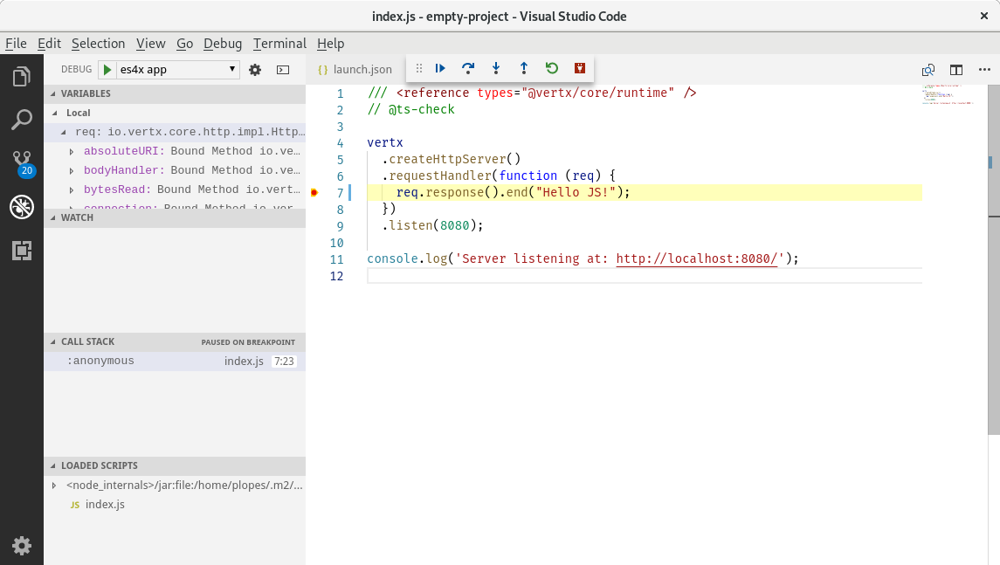

# Debug

## Chrome Inspector

Podczas pracy z [GraalVM](https://graalvm.org) lub JDK z graalvm (JVMCI) uruchom swoją aplikację jako:

```sh
npm start -- -Dinspect=9229
```

Rozpocznie to pracę debugera Chrome Inspector na porcie 9229, który możesz dołączyć do sesji debugowania z poziomu
swojej przeglądarki.

```
Chrome devtools listening at port: 9229
Running: java ...
Debugger listening on port 9229.
To start debugging, open the following URL in Chrome:
    chrome-devtools://devtools/bundled/js_app.html?ws=127.0.0.1:9229/436e852b-329b5c44c3e
Server listening at: http://localhost:8080/
```


Będziesz mógł ustawić brekapointy, debugować, itp.
You will be able to set breakpoints, debug etc...

## Debugowanie z VSCode

Używanie narzędzi developerskich od Chroma nie jest koniecznym wymogiem. Aplikacje można debugować również przy użyciu
[Visual Studio Code](https://code.visualstudio.com). Stwórz odpowiednią konfigurację:


```
es4x vscode
```

Stworzy to plik `launcher.json` podobny do:

```json
{
  "version" : "0.2.0",
  "configurations" : [ {
    "name" : "Launch empty-project",
    "type" : "node",
    "request" : "launch",
    "cwd" : "${workspaceFolder}",
    "runtimeExecutable" : "${workspaceFolder}/node_modules/.bin/es4x-launcher",
    "runtimeArgs" : [ "-Dinspect=5858" ],
    "port" : 5858,
    "outputCapture" : "std",
    "serverReadyAction" : {
      "pattern" : "started on port ([0-9]+)",
      "uriFormat" : "http://localhost:%s",
      "action" : "openExternally"
    }
  } ]
}
```

Pozstaje tylko dołączyć debuger.



Jeśli wypiszesz na ekranie wiadomość `Server started on port 8000` zostanie to odnotowane przez visual studio i w oknie
przeglądarki otworzy się odpowiedni adres url.
