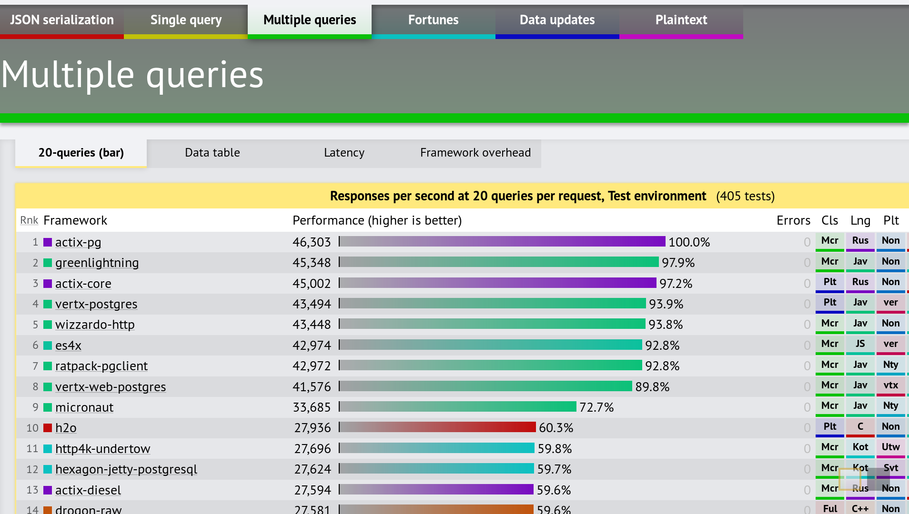

# Вступление

ES4X - небольшая среда выполнения для приложений EcmaScript >=5, которая работает на
[graaljs](https://github.com/graalvm/graaljs) с помощью [vert.x](https://vertx.io). JavaScript - язык времени
выполнения, но он **не** использует `nodejs`.

## Как это работает?

Разработка приложений ES4X не отличается от разработки других приложений на `JavaScript`. Файл `package.json`
описывает проект. Проект использует зависимости из 2 разных источников:

* [npm](https://www.npmjs.com/)
* **и** [maven central](https://search.maven.org/)

ES4X использует [GraalVM](https://www.graalvm.org) - среду выполнения на JVM с поддержкой многих языков. Вы можете
использовать любой язык JVM либо `JavaScript` в приложениях.

ES4X использует Vert.x для предоставления оптимизированного событийного цикла и высокой производительности библиотеки
чтения/записи. Использование `Java` из `JavaScript` может быть утомительным, так как IDE не может получить информацию по
типам или API "из коробки". Для этих целей ES4X содержит несколько опубликованных в `npm` пакетов, которые упрощают
разработку с помощью `shim` для соотношения `Java` API и `JavaScript`, а также полный API в виде файлов определения
`TypeScript` `.d.ts`.

## Производительность

ES4X был **самым быстрым** `JavaScript` согласно бенчмарку фреймворков TechEmpower
[Round #18](https://www.techempower.com/benchmarks/#section=data-r18). ES4X был самым быстрым на всех тестах в сравнении
с другими фреймворками `JavaScript`:

И ES4X был в первой десятке среди всех других фреймворков в нескольких тестах, показывая производительность лучше, чем у
самых популярных JVM фреймворков:

