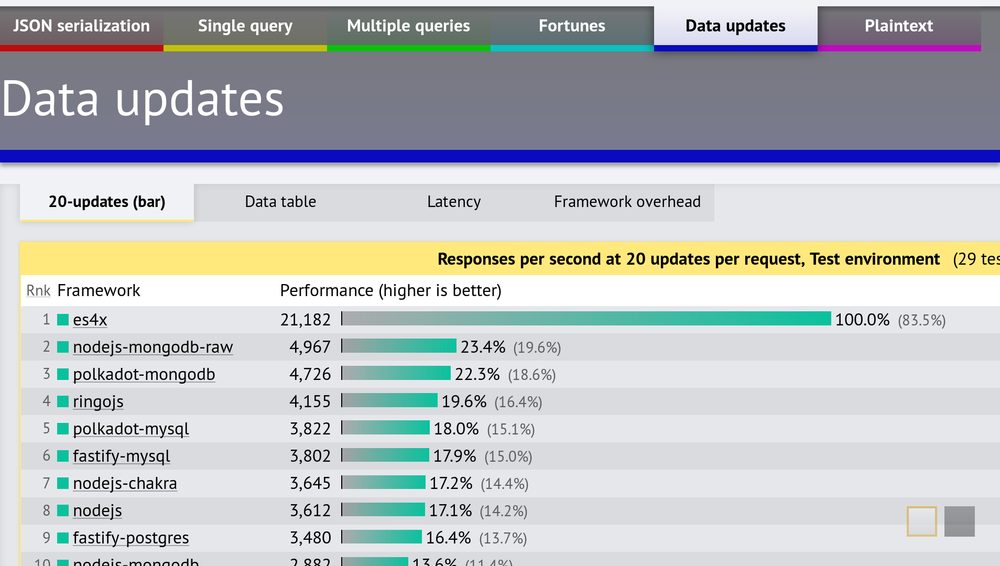

# 介绍

ES4X是一款支持EcmaScript >=5应用的小型运行时。该运行时借助[vert.x](https://vertx.io)并使用了[graaljs](https://github.com/graalvm/graaljs)实现。JavaScript是一个需要运行时支持的语言，但`nodejs`并非唯一的运行时，JavaScript可**不**借助`nodejs`运行。

## 工作原理

部署ES4X应用跟开发其他 `JavaScript` 应用并无太大区别。项目使用`package.json`文件定义，并从[npm](https://www.npmjs.com/)**及**[maven central](https://search.maven.org/)中获取依赖。

ES4X基于JVM扩展的多语言运行时[GraalVM](https://www.graalvm.org)。这意味着您在使用`JavaScript`的同时亦可使用其它的JVM语言。

ES4X使用Vert.x以提供优化后的 event loop 线程及高性能IO库。然后在`JavaScript`中使用`Java`可能会比较枯燥无味因为无法让IDE提供类型推断等原生支持。
有鉴于此，ES4X提供了一些发布在`npmjs`上的包以简化开发。包括一个小型的`shim`将`Java` API映射成`JavaScript` API并提供`.d.ts`定义文件。

## 性能表现

根据[第18轮](https://www.techempower.com/benchmarks/#section=data-r18)TechEmpower框架评测提供的数据，ES4X是**最快的**`JavaScript`框架：

并且在多项评测中，ES4X均位列所有框架前十，展示出比其它流行的JVM框架更好的表现：

