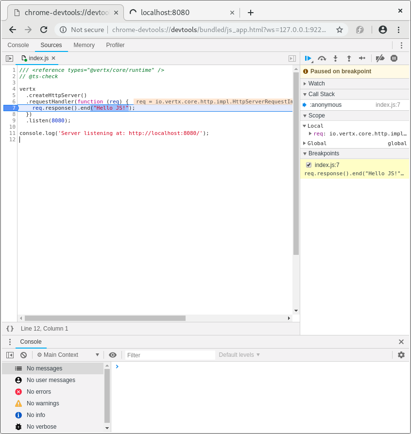

# 调试

## Chrome Inspector

在[GraalVM](https://graalvm.org)或者 a JDK with the graalvm (JVMCI) bits 上工作时，可以通过下面的命令启动您的应用：

```sh
npm start -- -Dinspect=9229
```

这将在端口9229上启动一个Chrome inspector调试器代理，您可以通过浏览器来附加到这个远程调试会话。

```
Chrome devtools listening at port: 9229
Running: java ...
Debugger listening on port 9229.
To start debugging, open the following URL in Chrome:
    chrome-devtools://devtools/bundled/js_app.html?ws=127.0.0.1:9229/436e852b-329b5c44c3e
Server listening at: http://localhost:8080/
```



此时您可以设置断点、调试……

## 使用VSCode调试

Chrome devtools并不是一个硬性要求。您还可以使用[Visual Studio Code](https://code.visualstudio.com)来调试您的应用。通过下面的命令来创建配置：

```
es4x vscode
```

这将会创建一个与下面内容相似的`launcher.json`文件：

```json
{
  "version" : "0.2.0",
  "configurations" : [ {
    "name" : "Launch empty-project",
    "type" : "node",
    "request" : "launch",
    "cwd" : "${workspaceFolder}",
    "runtimeExecutable" : "${workspaceFolder}/node_modules/.bin/es4x-launcher",
    "runtimeArgs" : [ "-Dinspect=5858" ],
    "port" : 5858,
    "outputCapture" : "std",
    "serverReadyAction" : {
      "pattern" : "started on port ([0-9]+)",
      "uriFormat" : "http://localhost:%s",
      "action" : "openExternally"
    }
  } ]
}
```

附加您的调试器。


如果您在应用中打印了`Server started on port 8000`，它将会被Visual Studio捕获并通过浏览器打开捕获到的链接。
